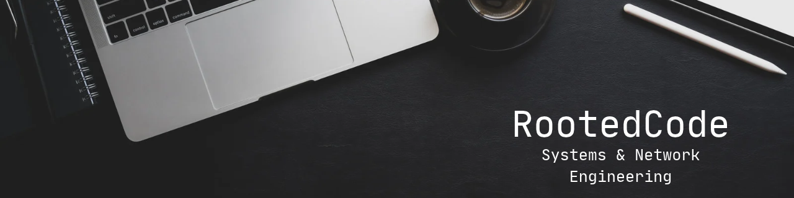

<h3 align="left">About me:</h3>

- 🔭 I'm currently working on a side project: **[0xEngine](#link-coming-soon)** powered by **[lib0x](#link-coming-soon)**

- 🌱 I'm currently in school for **Network Engineering and Administration**

- 👯 I'm looking to collaborate on **Open Source Projects**

<h3 align="left">Connect with me:</h3>

<!--  -->

<h3 align="left">Languages and Tools:</h3>

